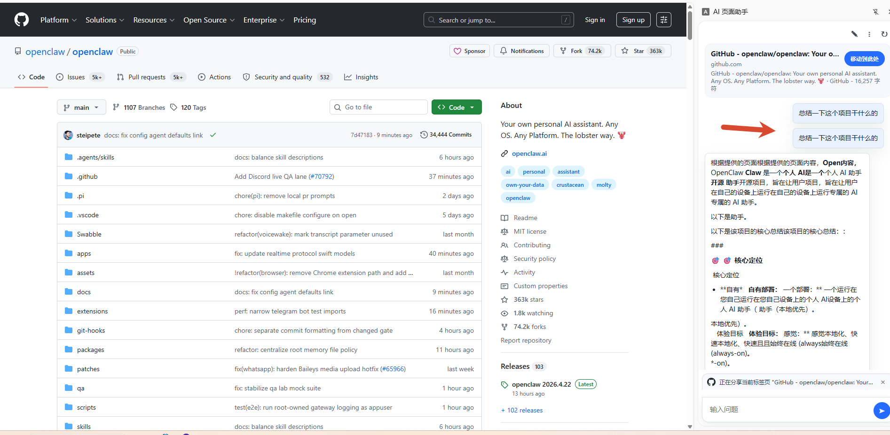
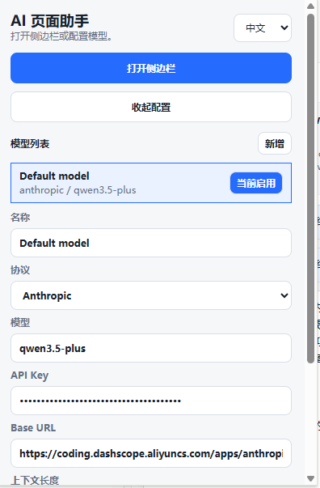

# AI 页面助手 Chrome 插件

一个基于 Chrome Side Panel 的网页阅读与问答插件。

它会读取当前网页内容，把页面正文、标题、描述、选中文本整理成上下文，再通过你配置的大模型进行对话。当前版本聚焦在“内置模型聊天”这一条主链，适合做网页总结、信息提取、问答分析和多页面整理。

## 功能特性

- 侧边栏聊天：在 Chrome 右侧侧边栏里直接和网页内容对话
- 多模型配置：支持配置多个模型并切换启用
- 协议支持：
  - OpenAI / OpenAI Compatible
  - Anthropic
- 流式输出：优先使用流式返回，提升回答体验
- Markdown 渲染：大模型返回的标题、列表、代码块、链接会按 Markdown 友好展示
- 页面记忆：
  - 添加当前页
  - 添加当前窗口全部标签页
  - 清空记忆
- 会话管理：
  - 新建会话
  - 查看历史会话
  - 删除当前会话
  - 会话内容持久化到本地
- 图片理解：
  - 当模型开启 `Enable image analysis` 后，支持上传图片作为附加输入
- 快捷键发送：
  - `Enter` 发送
  - `Ctrl+Enter` 发送

## 界面预览

### 侧边栏聊天



### 插件配置弹窗



## 安装方式

1. 下载或克隆本仓库
2. 打开 Chrome，进入 `chrome://extensions`
3. 打开右上角“开发者模式”
4. 点击“加载已解压的扩展程序”
5. 选择当前项目目录

## 使用方式

1. 点击插件图标
2. 在弹窗里配置模型
   - 协议
   - 模型名
   - API Key
   - Base URL
   - Context chars
   - 是否开启图片分析
3. 点击“Open side panel”打开侧边栏
4. 在任意网页中提问，插件会自动读取当前页面内容作为上下文

## 侧边栏能力说明

- 顶部按钮
  - 新建会话
  - 历史会话
  - 重新读取当前页面
- 页面卡片
  - 展示当前网页标题和域名
  - 支持重新绑定当前页面上下文
- 底部输入区
  - 文本提问
  - 图片上传
  - 停止回答

## 本地存储内容

插件使用 `chrome.storage.local` 保存以下数据：

- 模型配置
- 当前启用模型
- 会话历史
- 页面记忆
- 语言设置
- 发送快捷键设置

## 项目结构

```text
.
├─ manifest.json
├─ popup.html
├─ popup.js
├─ sidepanel.html
├─ sidepanel.js
├─ background.js
├─ content.js
├─ styles.css
└─ img/
```

## 适用场景

- 阅读技术文档并快速提问
- 总结产品页面或帮助中心内容
- 提取网页关键信息
- 汇总多个标签页内容
- 结合图片和网页文字做辅助分析

## 注意事项

- 只有普通网页内容可以被读取，浏览器内置页和部分特殊页面不可读
- 图片上传能力依赖当前启用模型是否支持视觉输入
- 如果模型接口不支持标准流式输出，插件会自动尝试回退到普通请求

## License

MIT
